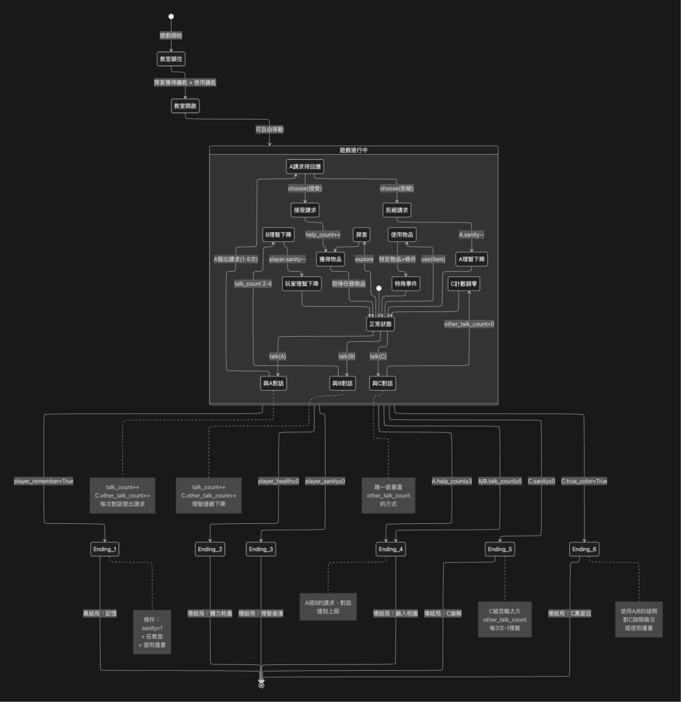

## 文字冒險遊戲（LLM API used）

這個專案使用 NetDB Lab 提供的 LLM API，實作一套由兩個 Agent 協作的文字冒險遊戲引擎。<br>
本專案作為計算理論課程之期末報告使用，展示課程所學之有限狀態機運作情形。

### 功能
- 根據玩家選擇，接收來自 Console 或 Web 中，以自然語言輸入的指令
- 將原指令提交給 Parser Agent 後，透過 LLM 進行判讀並得到結構化的遊戲指令
- 將結構化指令交由遊戲引擎進行判斷，確認玩家的要求是否合乎遊戲規則
- 若玩家的行為合法，則遊戲引擎將判斷行動後會產生的結果 Prompt
- 將 Prompt 提交給 Narrator Agent 後，透過 LLM 根據文本與角色當下狀態，產生相應的故事文本
- 將故事文本顯示於 Console 或 Web 上

### 專案結構
```
└─ src/     
  ├─ repository             邏輯層
  │ ├─ state.py             遊戲狀態
  │ ├─ engine.py            遊戲引擎
  │ ├─ parser.py            指令解析 Agent
  │ ├─ narrator.py          文本生成 Agent
  │ └─ game_assemble.py     整合 Repository
  ├─ ui                     UI 層
  └─ main.py                程式切入點
```

### 技術說明
本專案可以分為「邏輯層」與「UI 層」，分割使用者互動與遊戲機制的邏輯。

##### 邏輯層
- 遊戲狀態：儲存目前遊戲中角色、場景、物品、特殊事件的紀錄，可以確保流程是有限的
- 遊戲引擎：遊戲邏輯核心，判斷操作是否成功、事件是否觸發，可以確保流程是可再現的
- 雙代理人（Agent）：將 Agent 拆分為「決策」的 Parser 與「敘事」的 Narrator，降低 Prompt 的複雜度，也提高回覆的可控性
- 將上述邏輯整合後，對外向提供 UI 層唯一接口

##### UI 層
- 不包含任何遊戲邏輯，僅有如「輸入 API 資訊」以及顯示資訊的功能
- 與玩家、邏輯層提供的接口進行溝通，擔任訊息傳遞的角色

### 系統架構


### 安裝與執行
#### 使用環境
- Python 3.9
- 可以使用虛擬環境來執行程式

##### 安裝套件
```
pip install -r requirements.txt
```
包括 requests 與 streamlit，前者用於解析 JSON 結構，後者用於 UI 介面。

##### 執行
```
python -m src.main
```
執行程式後，會先於 CMD 提供操作介面的選擇（Console 或 Web）。<br>
若選擇 Console，將於相同還境中啟動遊戲，而若選擇 Web，則會自動開啟瀏覽器（若開啟失敗，則可由使用者複製連結後，自行於瀏覽器中開啟）。

### License
本專案僅供課程報告使用。
